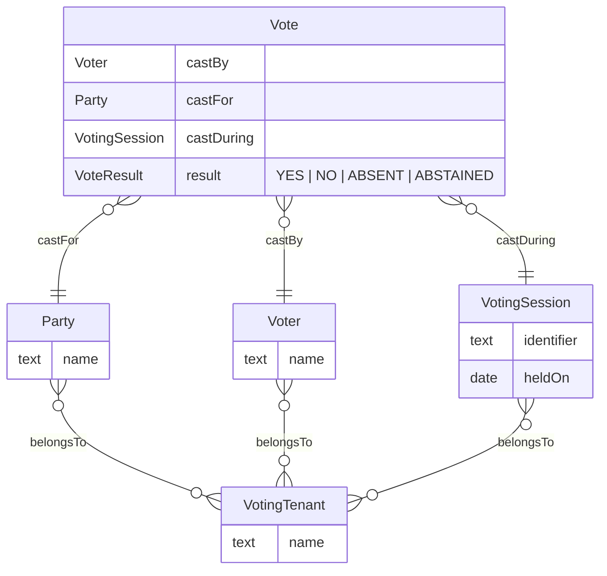
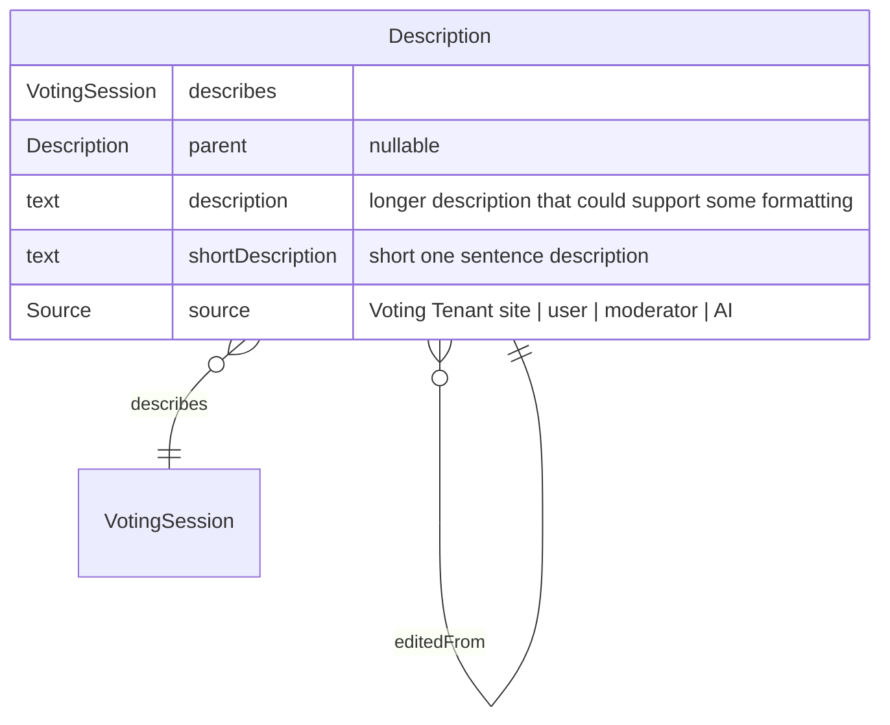
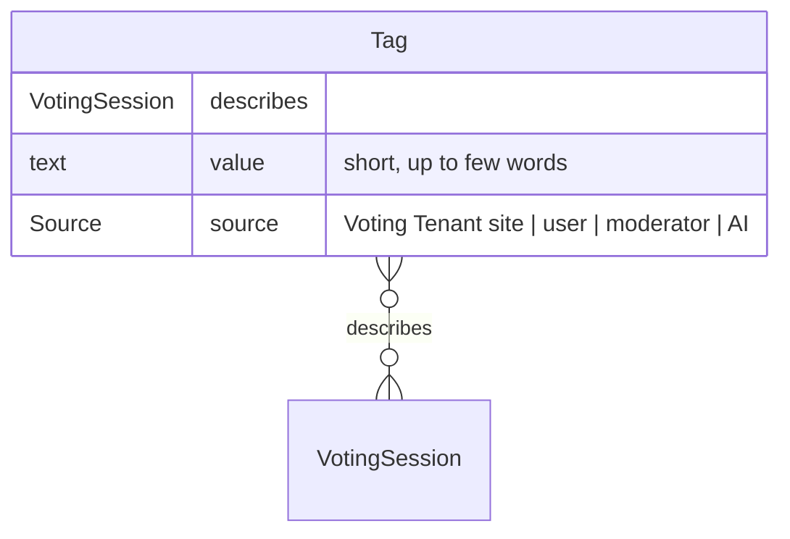
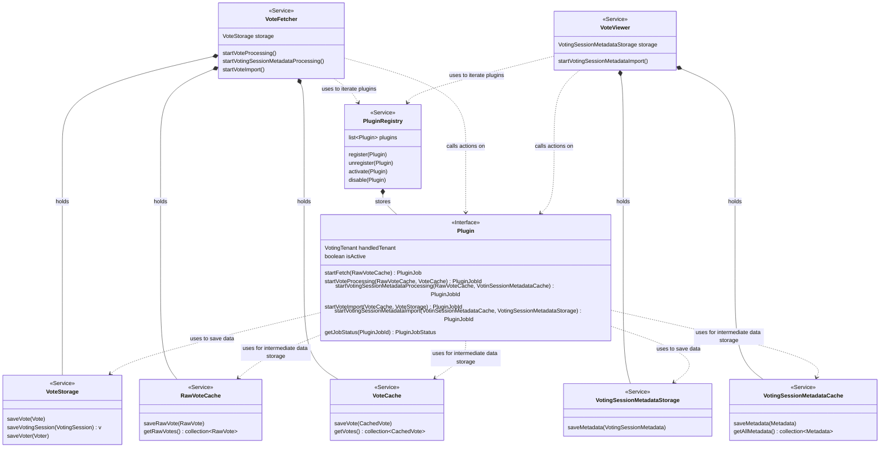
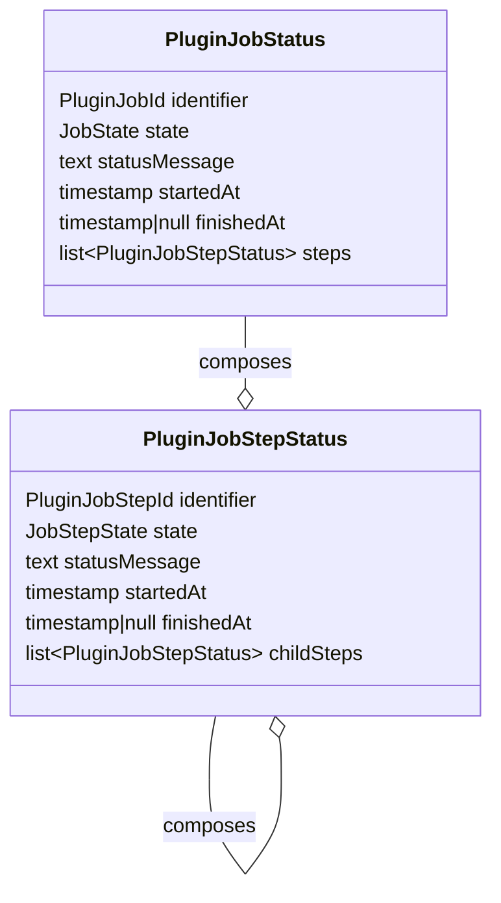
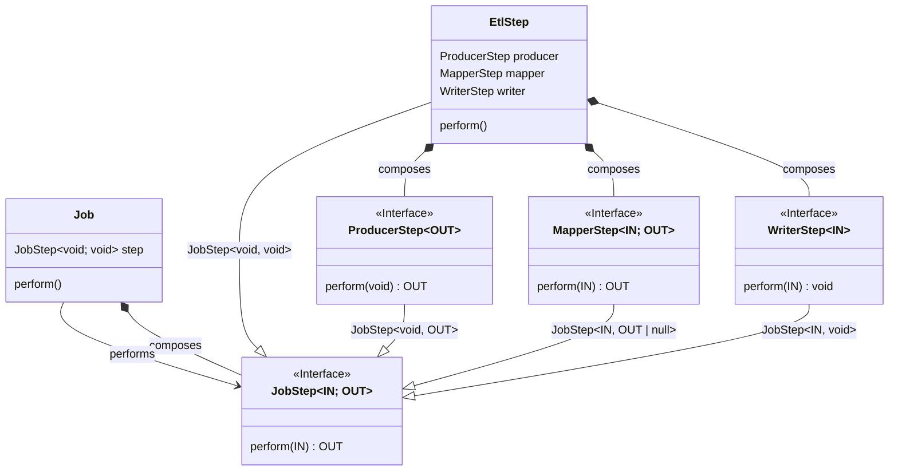
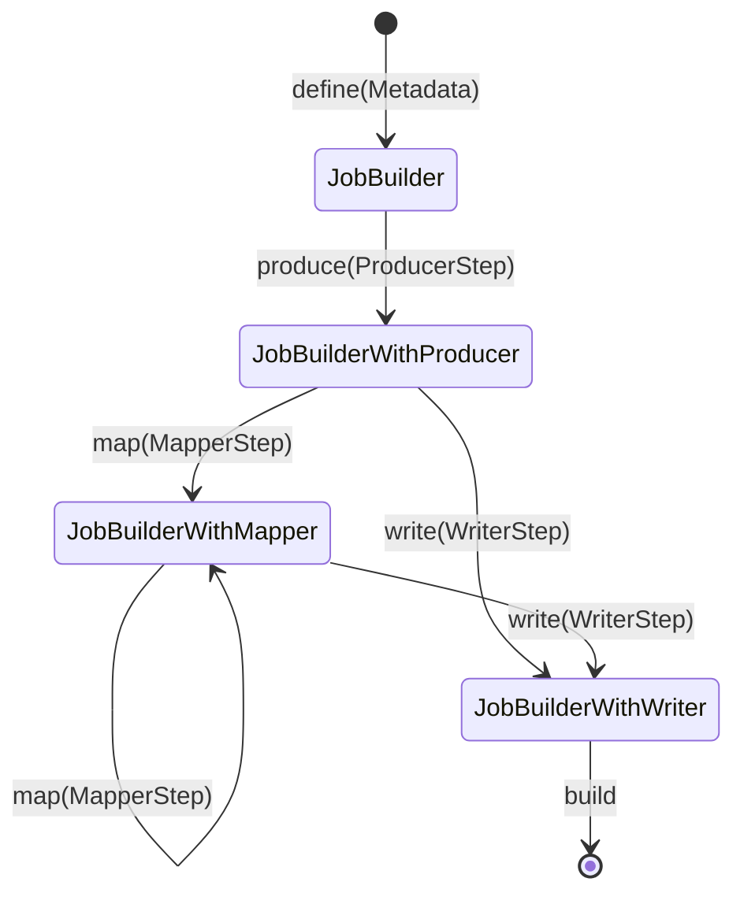
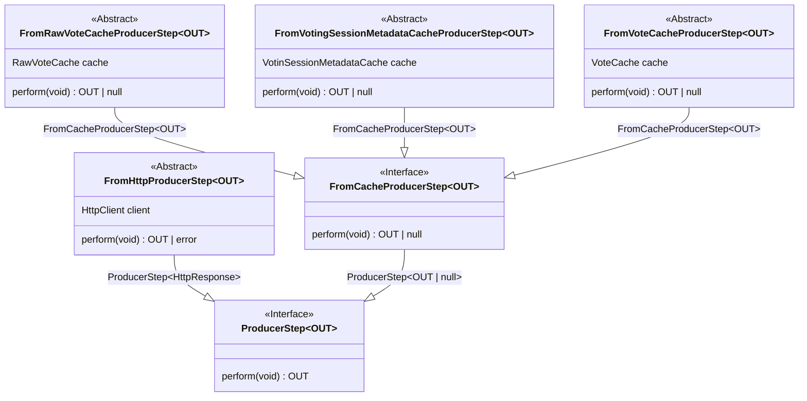
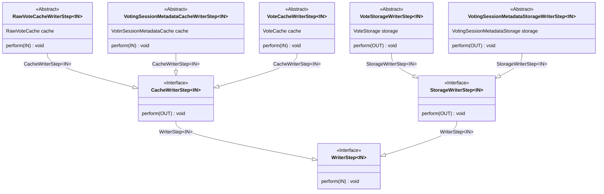

# 9.1. Redesign from initial project structure

Date: 2026-04-18

## Status

Accepted

## Context

Project was started long time ago and then abandoned due to lack of free time.
It was also developed as a training opportunity for Kotlin and Gradle.
After additional few years of experience it's a bit clear that the initial architecture could use some grand refactor.

### Topics to consider:

#### Data model

The data model is very tightly modeled after structure of the votes available fr the Polish Sejm.
This makes the current setup only consider Polish Sejm votes and has concepts that are not really that important (e.g.
voting day) for the application.

#### Fetching refactored into more appropriate ETL architecture

Fetching currently is a bit tightly coupled into whole system and uses messaging system to orchestrate everything.
This could be separated into more pipes and filter architecture.

#### Tenancy / Plugin like concepts for voting data sets.

Current setup only considers the Polish Sejm votes.
This could be abstracted with tenancy with plugin like vote fetching, allowing for integration with other voting
tenants.

### References:
- [Project big picture board](../01_introduction_and_goals/01_03_big_picture_board.png) - shows target solution with use-cases, architecture and domain boundaries.
- [vote fetcher design board](../05_building_block_view/05_02_vote_fetcher_design_board.png) - description of new fetcher that uses more ETL appropriate patterns.
- [vote viewer design board](../05_building_block_view/05_03_vote_viewer_design_board.png) - description of general user interface.
- [vote analyzer design board](../05_building_block_view/05_04_vote_analyzer_design_board.png) - description of the core of the project which is the analysis which parties/politicians vote the closest to user self-proclaimed preferences.

## Options

### Core model
The core model could be simplified to the four concepts as follows:

Effectively this would drop current Voting Day concept that grouped Voting Sessions, then introducing Voting Tenant.

The Voting Tenant would model the currently available organizations that hold voting sessions.
The Voters would be members of those organisations that can cast votes,
Parties would model the political parties which group Voters into some smaller sub-organization within the tenant
The voting sessions themselves will be a single voting held for specific reason (e.g. some Bill) where voters can cast single vote.

The Voters and Parties could belong to multiple Voting Tenants. This can be explained by such situation:
Polish Sejm and Senat would be different voting tenants though related tenants as they are both part of Polish Government system.
Political parties in Poland have members that belong to both organizations. 
Voters (so politicians) could also become members of either organization at different stages of their career.
Additionally, Voters could also switch parties in their career. 

With this the Vote contains the information which Voter cast it, for which part and during which session.
The information to what party the Voter belongs is often contained in the voting session data.
If not, then VotingTenant plugin would be tasked with keeping track of it.

## Voting Session metadata
It's obvious that users would require some rather curated descriptions of the Voting sessions that are held.
Not all sessions are relevant to most people so being able to see most find those that the user is interested will be crucial.
Most people will not care about some short bill with bipartisan support that fixes ambiguity of some specific law for trout population control.
But bill that gives big corpos tax break and raises tax on poor will probably be more interesting to broader audience.

So this has two aspects. Popularity of sessions that are picked by users will have tremendous information which sessions are generally useful.
Additionally, some description what the voting session was about is also crucial. 

People can 'do their own research' and find that voting No. 3 held on April 1st 2026
is the controversial one and want to check what politicians votes how.
And repeat that like 10 times to get some actually relevant sample of information. 

Also the names that government could provide might be misleading like 'Save the children act #1252'
that is 1 milion page bill about spending more tax dollars on main party affiliated corporations
and mandating common people to wear tracking device 24/7.

With that the various sources of descriptions would be good to be shown in the voting session information.

Idea is to have 4 sources of information:
- Raw descriptions from voting tenant site
- Moderator provided descriptions
- User provided descriptions
- AI generated descriptions based on the available data like voting tenant description or bill text

The raw descriptions would be an easy reference to government site for more information like what exactly was voted on.
The user provided descriptions could be done by both Moderators and normal users.
Moderators would have rather higher priority and show up rather immediately.
In addition users would be able to improve other descriptions like correct slight error, make description more concise.
The edits could be handled a bit differently,
so that 'mostly correct but popular' answer will persevere through sheer amount of votes
where edits would be stuck in low vote purgatory.
For example edits could ride on the popularity of the parents so that small overwhelmingly positive scores would quickly replace the parent description as the popular one.
Additionally the view could be more of a tree-like structure with edits more closely attached to their parents.

Though with all that, the user provided descriptions will definitely require some thorough scrutiny and moderation options.
Bad-faith actors could easily disrupt, mislead or take over the system if left unchecked.

Additionally this could be a nice place to integrate the AI, as it could give some starting point for users to refine descriptions themselves.
For example it might be feasible to feed the bill contents into LLM and get some usable description.
From that users could check the description, vote if it actually makes sense or
propose their own descriptions that fixes the errors the LLM made.

In addition to descriptions, the one/few word tags or labels could be a nice form of 'quick categorization' of the voting sessions.
Bills could get labels like 'taxes', 'farming' or 'housing' that would enhance searchability of relevant sessions.
Those tags could also be sourced from different sections.

### Plugin system for Voting tenants

In order to more easily add-in new voting data sets, each Voting Tenant could be a form of plugin within the system.
Each plugin would be responsible for collecting and parsing data into core model.
Optionally plugin could supply metadata for voting sessions if it can provide it.

#### Class breakdown

##### Core plugin classes
Plugins would be responsible for implementing Plugin interface

##### Job status
Plugins would require to provide the following status for started jobs:

##### Pipes and filter job steps
The plugins themselves could either freely define fetching or utilize the pipes and filters architecture using steps.

###### Core classes

###### Builder DSL

These then can be composed into single using the Builder like DSL

###### Producer classes
For producers, we would have these base options:

###### Mapper classes
For mappers, we would have these base options:

```mermaid
classDiagram
    class MapperStep~IN; OUT~ {
        <<Interface>>
        perform(IN) OUT
    }

    class ChainedMappersStep~IN; INTERMEDIATE; OUT~ {
        MapperStep<IN, INTERMEDIATE> firstMapper
        MapperStep<INTERMEDIATE; OUT> secondMapper
        perform(IN) OUT
    }
    ChainedMappersStep --|> MapperStep : MapperStep&ltIN, OUT&gt
    ChainedMappersStep *-- MapperStep : composes

    class FlatExtractorStep~IN; OUT~ {
        <<Abstract>>
        #extract(IN)* collection~OUT~
        perform(collection~IN~) collection~OUT~
    }
    ChainedMappersStep --|> MapperStep : MapperStep&ltIN, OUT&gt

    class FilterStep~IN~ {
        <<Abstract>>
        #matches(IN)* boolean
        perform(IN) OUT | null
    }
    FilterStep --|> MapperStep : MapperStep&ltIN, IN | null&gt

    class CollectionFilterStep~IN~ {
        <<Abstract>>
        #matches(IN)* boolean
        perform(collection&ltIN&gt) collection&ltIN&gt
    }
    FilterStep --|> MapperStep : MapperStep&ltcollection&ltIN&gt, collection&ltIN&gt&gt

    class CollectionMapperStep~IN; OUT~ {
        <<Abstract>>
        #map(IN)* OUT
        perform(collection&ltIN&gt) collection&ltOUT&gt
    }
    CollectionMapperStep --|> MapperStep : MapperStep&ltcollection&ltIN&gt, collection&ltOUT&gt&gt

    class NonNullCollectionStep~IN~ {
        perform(collection&ltIN | null&gt) collection&ltIN&gt
    }
    NonNullCollectionStep --|> MapperStep : MapperStep&ltIN | null, IN&gt

    class FromHttpRequestMapperStep~OUT~ {
        <<Interface>>
        perform(HttpRequest) OUT
    }
    NonNullCollectionStep --|> MapperStep : MapperStep&ltHttpRequest, OUT&gt

    class ToHttpRequestMapperStep~IN~ {
        <<Interface>>
        perform(IN) HttpRequest
    }
    NonNullCollectionStep --|> MapperStep : MapperStep&ltIN, HttpRequest&gt
```

###### Writer classes
For producers, we would have these base options:

## Decision

Accepted

## Consequences

Project will have to be refactored as per this document